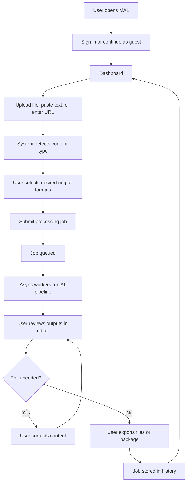

# Product Requirements Document
## Multimodal Accessibility Layer (MAL)

**Document Version:** 1.0  
**Status:** Draft for Review  
**Document Type:** University Software Engineering PRD  
**Owner:** MAL Project Team

---

### 1. Product Overview

The Multimodal Accessibility Layer (MAL) is a software platform that ingests digital content in multiple modalities — text, images, audio, video, and documents — and transforms it into accessible alternatives that meet the needs of users with visual, hearing, reading, language, or cognitive accessibility requirements.

MAL acts as a unified middleware between source content and the end user. Instead of relying on multiple disconnected accessibility tools (separate transcription apps, alt-text generators, screen-reader formatters, translation tools), MAL provides a single workflow that detects content type, applies the appropriate AI-assisted transformation, allows human review, and exports accessible deliverables in standard formats.

The product is designed for both individual users (students, researchers, content creators) and institutional users (universities, public-sector organisations) that must comply with accessibility legislation such as WCAG 2.2, Section 508, and EN 301 549.

---

### 2. Problem Statement

Digital content is overwhelmingly multimodal, but its accessibility support is fragmented and inconsistent:

- Images on the web frequently lack meaningful alternative text.
- Audio and video content is often published without captions or transcripts.
- Long documents are written at reading levels that exclude users with cognitive or language difficulties.
- PDFs are commonly untagged and unreadable by screen readers.
- Accessibility outputs are produced by separate tools, each with different formats and quality, requiring users to coordinate workflows manually.

As a result, users with disabilities encounter avoidable barriers, content creators struggle to comply with accessibility standards, and institutions risk non-compliance. A unified solution that consolidates accessibility transformations into one reviewable, exportable workflow does not yet exist in the open-source / academic space.

---

### 3. Goals and Non-Goals

#### 3.1 Goals
- Provide a single workflow that converts any supported input modality into one or more accessible output formats.
- Reduce the time required to produce accessibility-ready content from hours to minutes.
- Allow human review and correction of every AI-generated output before export.
- Comply with WCAG 2.2 AA in the MAL interface itself.
- Produce evaluation evidence (quality, performance, user study) suitable for academic assessment.

#### 3.2 Non-Goals
- MAL is not a content authoring or editing platform (it does not replace word processors, video editors, or design tools).
- MAL does not provide live real-time captioning in the MVP (offline/asynchronous only).
- MAL does not host or distribute end-user content as a public CDN.
- MAL does not attempt to replace human accessibility auditors for legal compliance certification.
- MAL does not target mobile-native applications in the MVP (responsive web only).

---

### 4. Target Users and User Personas

#### 4.1 Primary User Segments
- Users who are blind or have low vision.
- Users who are deaf or hard of hearing.
- Users with dyslexia or cognitive processing differences.
- Non-native speakers requiring translation or simplified language.
- Educators and students preparing accessible learning materials.

#### 4.2 Personas

**Persona 1 — Aisha, university student, low vision**
- Uses NVDA screen reader and high-contrast themes.
- Receives lecture slides and PDFs that are not screen-reader friendly.
- Needs alt text for charts and a clean reading order from documents.
- Pain point: spends 2–3 hours per week reformatting course materials.

**Persona 2 — Daniel, lecturer**
- Publishes recorded lectures and PDF notes.
- Has a legal obligation to provide accessible content but limited time.
- Needs captions, transcripts, and tagged documents produced quickly.
- Pain point: existing tools require separate uploads and manual stitching.

**Persona 3 — Mei, content creator, deaf**
- Consumes online video content for research.
- Auto-generated captions are often inaccurate or missing.
- Needs editable transcripts and properly timed captions.
- Pain point: must trust opaque auto-captioning with no review interface.

**Persona 4 — Karim, professional with dyslexia**
- Reads long technical documents for work.
- Benefits from plain-language summaries and text-to-speech.
- Pain point: switches between summarisers, TTS apps, and reading-mode extensions.

**Persona 5 — Institutional Accessibility Officer**
- Procures tools to support a population of students and staff.
- Needs auditable processing logs and data retention controls.
- Pain point: most consumer accessibility tools lack institutional governance.

---

### 5. User Stories

Each story follows the format: *As a [persona], I want [capability] so that [benefit].*

**Content ingestion**
- As a user, I want to upload an image, audio file, video, PDF, or paste text so that I can process any supported content type in one place.
- As a user, I want to provide a URL so that I can process remote content without manual download.

**Output generation**
- As a blind user, I want descriptive alt text and long descriptions for images so that I can understand visual content with my screen reader.
- As a deaf user, I want accurate captions and a transcript so that I can consume audio and video content.
- As a user with dyslexia, I want a plain-language summary so that I can understand long documents quickly.
- As a non-native speaker, I want translated accessible content so that I can consume it in my preferred language.
- As any user, I want a text-to-speech version of the content so that I can listen instead of read.

**Review and export**
- As a user, I want to review and edit every AI-generated output before exporting so that I can correct errors.
- As a user, I want to export outputs as standard files (`.txt`, `.srt`, `.vtt`, `.mp3`, tagged PDF, accessible HTML) so that I can use them in any platform.
- As a user, I want to see my history of processed jobs so that I can re-download or re-edit previous outputs.

**Account and preferences**
- As a user, I want to save accessibility preferences (default language, reading level, contrast theme) so that outputs match my needs by default.
- As a user, I want to delete my data so that I retain control over my content.

**Institutional**
- As an accessibility officer, I want audit logs of processing activity so that I can demonstrate governance.

---

### 6. Functional Requirements

The system MUST:

- **FR-1** Accept uploads of the following file types: `.txt`, `.md`, `.png`, `.jpg`, `.jpeg`, `.webp`, `.mp3`, `.wav`, `.m4a`, `.mp4`, `.mov`, `.pdf`, `.docx`.
- **FR-2** Accept text input via a paste field and remote content via a URL field.
- **FR-3** Detect input modality automatically and present applicable output options.
- **FR-4** Produce, on user request, the following outputs: alt text, long image description, transcript, time-aligned captions (`.srt` and `.vtt`), plain-language summary, translated version, audio narration (TTS), and accessible HTML view.
- **FR-5** Run processing jobs asynchronously with visible progress states (queued, processing, completed, failed).
- **FR-6** Provide an editable review interface for every generated output before final export.
- **FR-7** Allow export of outputs individually or as a single packaged archive.
- **FR-8** Maintain a per-user job history with re-download and re-edit access.
- **FR-9** Support user accounts with authentication and per-user data isolation.
- **FR-10** Allow users to configure accessibility preferences that apply to all subsequent outputs.
- **FR-11** Allow users to delete individual jobs or all of their data on demand.
- **FR-12** Surface AI confidence indicators or "review recommended" flags for low-confidence outputs.

The system SHOULD:

- **FR-13** Support multiple simultaneous output requests on a single input within one job.
- **FR-14** Provide keyboard shortcuts for the review interface.

The system MAY (out of MVP scope):

- **FR-15** Provide a public API for programmatic access.
- **FR-16** Provide a browser extension for in-page accessibility transformation.

---

### 7. Non-Functional Requirements

- **NFR-1 Performance:** Image alt-text generation must complete within 15 seconds for files up to 10 MB. Audio transcription must process at no slower than 0.5x real-time on the target deployment hardware.
- **NFR-2 Availability:** The web application must achieve at least 99% uptime during the evaluation period.
- **NFR-3 Scalability:** The processing pipeline must support horizontal scaling of worker processes without code changes.
- **NFR-4 Reliability:** Failed jobs must be retried up to 3 times with exponential backoff before being marked as failed.
- **NFR-5 Maintainability:** Code must follow a consistent style enforced by linters and have at least 70% unit test coverage on backend modules.
- **NFR-6 Portability:** The system must run via Docker Compose on a single developer machine and be deployable to a single cloud VM.
- **NFR-7 Observability:** Every processing job must produce structured logs and per-stage timing metrics.
- **NFR-8 Internationalisation:** The interface must support at least English at MVP, with a string externalisation pattern that allows additional locales to be added without code changes.
- **NFR-9 Browser support:** The interface must function correctly on the latest two major versions of Chrome, Firefox, Safari, and Edge.

---

### 8. Accessibility Requirements

The MAL interface itself must be accessible. The product cannot credibly serve accessibility users if its own UI is inaccessible.

- **AR-1** Conform to **WCAG 2.2 Level AA** for all user-facing pages.
- **AR-2** Provide full keyboard operability for all interactive elements, including the review editor.
- **AR-3** Provide visible focus indicators with a minimum 3:1 contrast ratio against adjacent colours.
- **AR-4** Use semantic HTML landmarks (`header`, `nav`, `main`, `aside`, `footer`) on every page.
- **AR-5** Use ARIA only where native HTML semantics are insufficient; never override native semantics unnecessarily.
- **AR-6** Announce asynchronous status changes (job started, completed, failed) via an ARIA live region.
- **AR-7** Provide a high-contrast theme and a user-selectable text size of at least 200% without loss of content or functionality.
- **AR-8** Ensure all form fields have programmatically associated labels and clear error messages.
- **AR-9** Support screen-reader testing on NVDA (Windows) and VoiceOver (macOS) as part of the QA process.
- **AR-10** Pass automated accessibility checks via axe-core with zero critical or serious violations on every page.
- **AR-11** Caption outputs must follow recommended caption formatting: maximum 2 lines, ~32–37 characters per line, minimum display duration of 1 second, speaker labels where multiple speakers are detected.
- **AR-12** Generated PDFs must be tagged and pass PAC (PDF Accessibility Checker) baseline checks.

---

### 9. AI Feature Requirements

- **AI-1** **Vision-language alt text** — generate concise alt text (≤125 characters) and an optional long description (≤1000 characters) for uploaded images.
- **AI-2** **Optical character recognition (OCR)** — extract text from images and scanned PDFs with a target character accuracy of ≥95% on standard printed material.
- **AI-3** **Automatic speech recognition (ASR)** — produce transcripts with target word error rate (WER) of ≤15% on clean English audio.
- **AI-4** **Caption generation** — produce time-aligned captions in `.srt` and `.vtt` formats with maximum sync drift of 500 ms.
- **AI-5** **Summarisation** — produce a plain-language summary at a configurable target reading level (default Flesch reading-ease ≥60).
- **AI-6** **Translation** — translate any text output to at least one additional language at MVP (English → Mandarin, with extensibility to others).
- **AI-7** **Text-to-speech** — generate natural-sounding narration in at least one English voice with adjustable speaking rate.
- **AI-8** **Quality scoring** — every AI output must be returned with a confidence score and a "review recommended" flag for low-confidence results.
- **AI-9** **Bias and safety** — the system must include a documented review of model limitations, known failure modes (e.g. described race/gender in alt text), and mitigations (human review required, neutral language defaults).
- **AI-10** **Reproducibility** — the model versions used for each output must be recorded with the job metadata.

---

### 10. Input and Output Formats

#### 10.1 Supported Inputs

- **Text:** `.txt`, `.md`, pasted text (max 100,000 characters per job).
- **Images:** `.png`, `.jpg`, `.jpeg`, `.webp` (max 10 MB).
- **Audio:** `.mp3`, `.wav`, `.m4a` (max 100 MB, max 60 minutes).
- **Video:** `.mp4`, `.mov` (max 500 MB, max 30 minutes for MVP).
- **Documents:** `.pdf`, `.docx` (max 50 MB).
- **URLs:** HTTP(S) links to supported file types or HTML pages.

#### 10.2 Supported Outputs

- **Alt text:** plain text, embedded in accessible HTML or downloadable `.txt`.
- **Long image description:** `.txt` or accessible HTML.
- **Transcript:** `.txt` and `.docx`.
- **Captions:** `.srt` and `.vtt`.
- **Summary:** `.txt`, `.md`, accessible HTML.
- **Translation:** same formats as the source output.
- **Audio narration (TTS):** `.mp3`.
- **Accessible HTML view:** semantic, WCAG 2.2 AA conformant.
- **Tagged PDF:** for document inputs only.
- **Job package:** `.zip` containing all selected outputs plus a manifest `.json`.

---

### 11. User Journey

The end-to-end user journey is summarised below.

**Narrative walkthrough:**
1. The user opens MAL and signs in (or continues as guest with limited features).
2. From the dashboard, the user uploads content or provides a URL.
3. MAL identifies the modality and presents applicable output options with explanations.
4. The user selects desired outputs and submits the job.
5. The dashboard displays live status. Long-running jobs notify the user on completion.
6. When ready, the user opens the Review Studio to inspect each output, with the source side-by-side.
7. The user edits where necessary, with confidence flags highlighting low-confidence sections.
8. The user exports outputs individually or as a package.
9. The job is added to the user's history and can be re-downloaded or re-edited later.

---

### 12. Error Handling Requirements

- **EH-1** All user-facing errors must be expressed in plain language with a recommended next action (no raw stack traces or codes alone).
- **EH-2** File upload failures (unsupported type, exceeds size limit, malformed file) must be detected client-side where possible and re-validated server-side.
- **EH-3** Network interruptions during upload must allow resume or retry without losing user form input.
- **EH-4** Processing failures must be retried up to 3 times with exponential backoff. After final failure, the user must be notified with the reason category (e.g. "audio could not be decoded").
- **EH-5** Partial pipeline success (e.g. transcript succeeded, translation failed) must be preserved and presented; failed sub-tasks must be individually retryable.
- **EH-6** Authentication and authorisation failures must redirect to a clear sign-in screen without exposing internal state.
- **EH-7** All errors must be logged server-side with a correlation ID that the user can quote for support.
- **EH-8** The system must degrade gracefully when an AI provider is unavailable: the affected output type is disabled with an explanation, and other outputs continue to function.
- **EH-9** Validation errors in the review editor (e.g. caption timestamps overlapping) must be inline, accessible, and non-blocking until export.

---

### 13. Privacy and Data Retention Rules

- **PR-1** All uploads and generated outputs must be encrypted in transit (TLS 1.2+) and at rest.
- **PR-2** Each user's data must be logically isolated; access to another user's content must be impossible through the API.
- **PR-3** Authenticated users may set a per-job retention period: 24 hours, 7 days, 30 days, or "until deleted" (default 30 days).
- **PR-4** Guest users' data must be auto-deleted within 24 hours of job completion.
- **PR-5** Users must be able to delete any individual job or their entire account and all associated data on demand. Deletion must be irreversible and complete within 24 hours.
- **PR-6** When a third-party AI service is used, the user must be informed at upload time and must consent before the data leaves the system.
- **PR-7** No user content may be used to train models without explicit, separate, opt-in consent.
- **PR-8** Audit logs must record actions (uploads, jobs, exports, deletions) but must not store the content itself.
- **PR-9** Personally identifiable information detected in transcripts (e.g. emails, phone numbers) must be flagged with an option for the user to redact before export.
- **PR-10** The system must publish a clear, plain-language privacy notice describing what is processed, where, by whom, and for how long.
- **PR-11** The system must comply with GDPR principles for data minimisation, purpose limitation, and the right to erasure.

---

### 14. Success Metrics

#### 14.1 Quality metrics
- Mean alt-text relevance score ≥ 4.0 / 5.0 on a human evaluation rubric across a 50-image sample.
- Word error rate (WER) ≤ 15% on a curated 30-minute clean English audio test set.
- Caption sync drift ≤ 500 ms on 95% of generated captions.
- Summary readability within ±5 of the target Flesch reading-ease score on 90% of generated summaries.

#### 14.2 Accessibility UX metrics
- ≥ 90% task success rate for screen-reader-only users on a defined set of 5 core tasks during user testing.
- ≥ 90% task success rate for keyboard-only users on the same task set.
- Zero critical or serious axe-core violations across all pages.
- Time-to-first-accessible-output ≤ 30 seconds median across mixed input types.

#### 14.3 System metrics
- Job failure rate ≤ 2% across all submitted jobs.
- Median end-to-end pipeline latency tracked per content type and reported in the evaluation.
- Worker throughput sufficient to clear the queue within 5 minutes under a 10-job concurrent load test.

#### 14.4 User-impact metrics
- Self-reported user satisfaction ≥ 4.0 / 5.0 (Likert scale) in the closing user study.
- Manual correction rate (proportion of generated outputs edited before export) tracked as an inverse quality signal.

---

### 15. MVP Feature List

The MVP delivers the smallest coherent product that demonstrates MAL's value end-to-end and is feasible within a single university semester.

**In MVP:**
- User sign-up, sign-in, sign-out.
- Single-user upload of: image, audio, video, PDF, plain text.
- Output generation: alt text, transcript, captions (`.srt`/`.vtt`), plain-language summary, TTS audio.
- Review and edit interface for every output.
- Export individual outputs and packaged `.zip`.
- Job history with re-download.
- Accessibility preferences (contrast theme, default language, default reading level).
- WCAG 2.2 AA conformance for all delivered pages.
- Asynchronous processing with progress indication and ARIA live announcements.
- Per-user data isolation, manual deletion, default 30-day retention.
- Structured logging and per-job audit record.
- Automated test suite (unit, integration, axe-core accessibility checks).

**Explicitly excluded from MVP:**
- Translation (planned for Phase 2).
- Video audio descriptions (planned for Phase 2).
- Browser extension.
- Public REST API.
- Mobile-native applications.
- Real-time / live captioning.
- Collaborative review (multiple reviewers per job).

---

### 16. Future Roadmap

**Phase 2 — Expanded outputs and reach**
- Multilingual translation across all output types.
- Video audio descriptions with scripted narration.
- Public read/write REST API with API keys.
- Browser extension that processes the active page.

**Phase 3 — Real-time and integration**
- Live captioning for meetings and lectures.
- LMS integrations (Moodle, Canvas) and CMS plugins (WordPress).
- Webhook system for institutional pipelines.

**Phase 4 — Personalisation and governance**
- Adaptive accessibility profiles that learn user preferences over time.
- Collaborative review workflow with editor and approver roles.
- Domain-specific output modes (education, legal, healthcare) with tuned prompts.
- Institutional admin console with usage analytics and policy controls.

**Phase 5 — Privacy-preserving deployment**
- Federated or on-device inference modes for high-privacy environments.
- Self-hostable enterprise edition with single-sign-on (SSO) and audit export.

---

### Appendix A — Glossary
- **Modality:** a category of content (text, image, audio, video, document).
- **Alt text:** short textual description of an image read by screen readers.
- **ASR:** Automatic Speech Recognition.
- **OCR:** Optical Character Recognition.
- **TTS:** Text-To-Speech.
- **WCAG:** Web Content Accessibility Guidelines.
- **WER:** Word Error Rate, a transcription accuracy metric.

### Appendix B — Document Control
- **Version 1.0** — Initial draft for university submission review.
